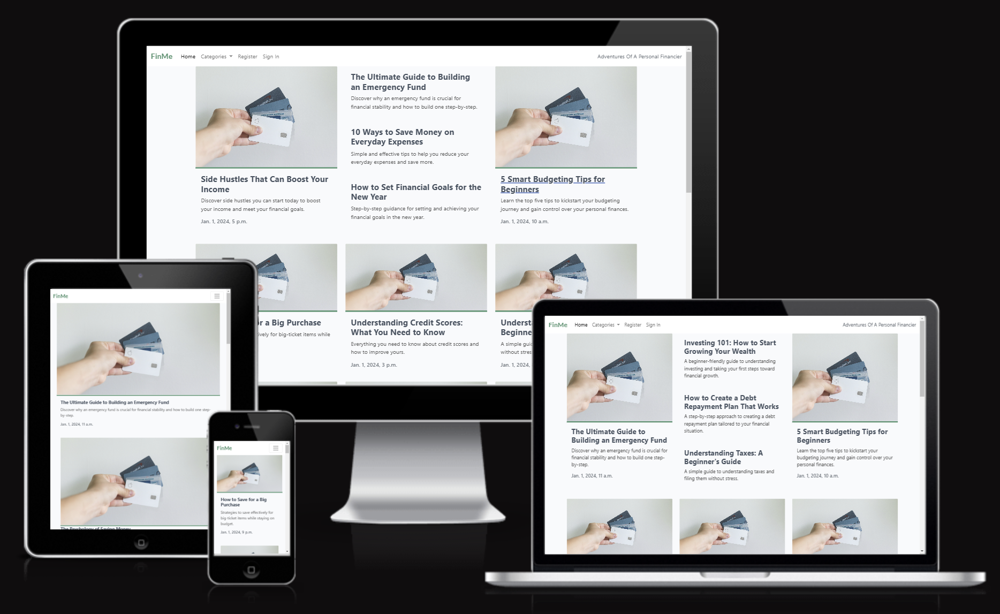
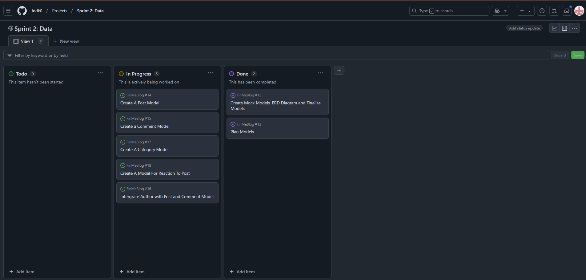
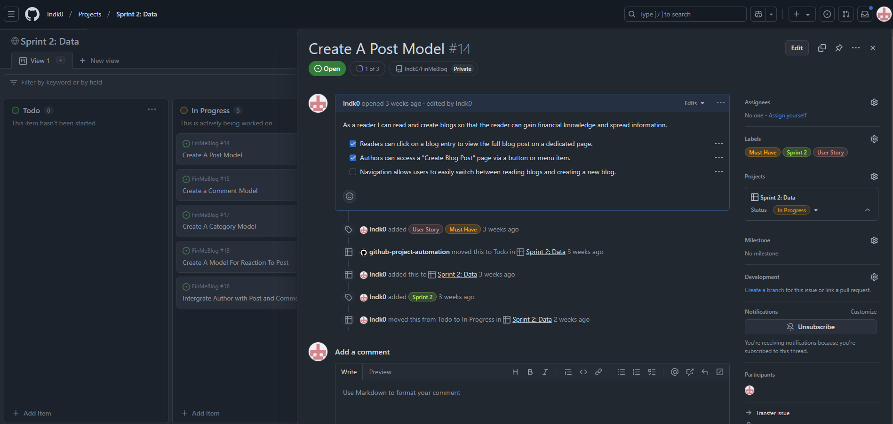
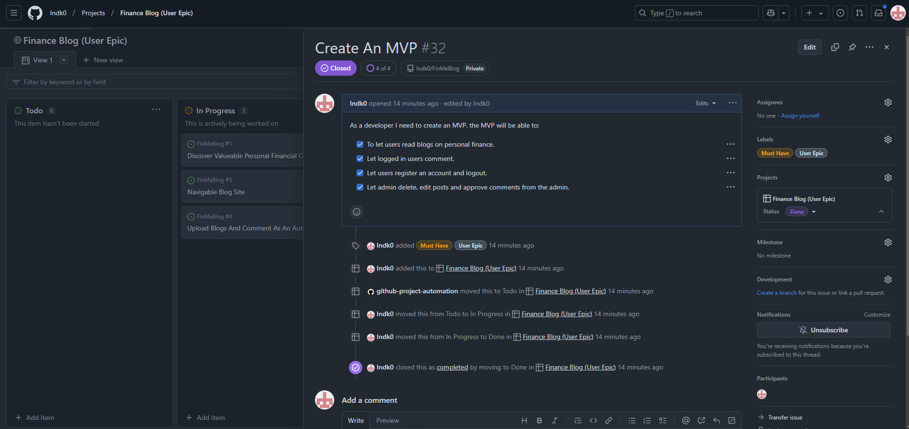

# FinMe Blog

## Introduction

#### FinMe is a finance blog aimed at people who are interested in expanding their personal finance knowledge through reading blogs about the basic to expert level personal financial knowledge.

## Table of Contents
- [Introduction](https://github.com/Indk0/FinMeBlog?tab=readme-ov-file#introduction)
- [Project Overview](https://github.com/Indk0/FinMeBlog?tab=readme-ov-file#introduction)
  - [Key Goals](https://github.com/Indk0/FinMeBlog?tab=readme-ov-file#key-goals)
  - [Target Audience](https://github.com/Indk0/FinMeBlog?tab=readme-ov-file#target-audience)
  - [User Requirements](https://github.com/Indk0/FinMeBlog?tab=readme-ov-file#user-requirements)
- [Planning](https://github.com/Indk0/FinMeBlog?tab=readme-ov-file#introduction) 
  - [Wireframes](https://github.com/Indk0/FinMeBlog?tab=readme-ov-file#wireframes)
  - [ERD Diagrams](https://github.com/Indk0/FinMeBlog?tab=readme-ov-file#erd-diagrams)
  - [Security](https://github.com/Indk0/FinMeBlog?tab=readme-ov-file#security)
- [Project Management](https://github.com/Indk0/FinMeBlog?tab=readme-ov-file#project-managements)
  - [Agile Methodologies](https://github.com/Indk0/FinMeBlog?tab=readme-ov-file#agile-methodologies)
  - [User Epics](https://github.com/Indk0/FinMeBlog?tab=readme-ov-file#user-epics)
  - [User Stories](https://github.com/Indk0/FinMeBlog?tab=readme-ov-file#user-story)
  - [MoSCoW](https://github.com/Indk0/FinMeBlog?tab=readme-ov-file#moscow)
  - [Sprints](https://github.com/Indk0/FinMeBlog?tab=readme-ov-file#sprints)
  - [MVP](https://github.com/Indk0/FinMeBlog?tab=readme-ov-file#mvp-minimal-viable-product)
- [Design](https://github.com/Indk0/FinMeBlog?tab=readme-ov-file#introduction)
  - [Colour Pallets](https://github.com/Indk0/FinMeBlog?tab=readme-ov-file#colour-pallets)
  - [Font](https://github.com/Indk0/FinMeBlog?tab=readme-ov-file#font)
  - [Favicon](https://github.com/Indk0/FinMeBlog?tab=readme-ov-file#favicon)
- [Technologies](https://github.com/Indk0/FinMeBlog?tab=readme-ov-file#introduction)
  - [Languages/Frameworks](https://github.com/Indk0/FinMeBlog?tab=readme-ov-file#languagesframeworks)
  - [Database](https://github.com/Indk0/FinMeBlog?tab=readme-ov-file#database)
  - [Other tools](https://github.com/Indk0/FinMeBlog?tab=readme-ov-file#other-tools)
- [Deployment](https://github.com/Indk0/FinMeBlog?tab=readme-ov-file#deployment)
  - [Pre-Deployment](https://github.com/Indk0/FinMeBlog?tab=readme-ov-file#pre-deployment)
  - [GitHub Deployment](https://github.com/Indk0/FinMeBlog?tab=readme-ov-file#github-deployment)
  - [Deploying with Heroku](https://github.com/Indk0/FinMeBlog?tab=readme-ov-file#deploying-with-heroku)
- [Testing](https://github.com/Indk0/FinMeBlog?tab=readme-ov-file#testing)
  - [Manual Testing](https://github.com/Indk0/FinMeBlog?tab=readme-ov-file#manual-testing)
- [Validation](https://github.com/Indk0/FinMeBlog?tab=readme-ov-file#validation)
  - [HTML Validation](https://github.com/Indk0/FinMeBlog?tab=readme-ov-file#html-validation)
  - [CSS Validation](https://github.com/Indk0/FinMeBlog?tab=readme-ov-file#css-validation)
  - [Python Validation](https://github.com/Indk0/FinMeBlog?tab=readme-ov-file#python-validation)
  - [JS Validation](https://github.com/Indk0/FinMeBlog?tab=readme-ov-file#js-validation)
  - [Bug/Errors/Warnings Fixes](https://github.com/Indk0/FinMeBlog?tab=readme-ov-file#bugerrorswarnings-fixes)
- [Site Performance Testing](https://github.com/Indk0/FinMeBlog?tab=readme-ov-file#site-performance-testing)
- [Fixes After Site Testing](https://github.com/Indk0/FinMeBlog?tab=readme-ov-file#fixes-after-site-testing)
- [Future Features/Considerations](https://github.com/Indk0/FinMeBlog?tab=readme-ov-file#future-featuresconsiderations)
- [Acknoledgements](https://github.com/Indk0/FinMeBlog?tab=readme-ov-file#acknowledgements)

## Project Overview
### Key goals
#### The key goal for this project is to create a functioning personal finance blog for readers who want to increase their personal finance knowledge. Readers will be able to select from a variety of blog which explore topics from investing to budgeting. The blog will also have a carousel of stocks on the home and blog pages, this however will be a could have feature.

### Target audience
#### My target audience are people who are interested in personal finance aged between 18-35, my target audience could be as young as 16. My target audience will also be very aware of how important financial health is for themselves.
### User Requirements - The projects have all of the in-depth issues. These are the basic user requirements:
#### Must Have: User Should be able to access the site and read the many blogs available.
#### Should Have: Should blogs may contain guides and tips to help readers take actionable steps on their personal finances.
#### Could Have: Readers can also create accounts from which they can post blogs and comment
### Future consideration are listed at the bottom of this ReadMe file.

### Inspiration
#### The inspiration for this blog comes from a site called Yahoo Finance, I have used Yahoo Finance in the past to read on news regarding the economy and the financial health of American technology companies. The key difference is that FinMe Blog will be tailored more towards to personal finance instead of the American stock market. 

#### Yahoo Finance is more geared towards readers who have an advanced knowledge in topics such as the economy and the American stock market, FinMe will be aimed at readers who are at the beginning stages of their personal financial journey to advanced readers who might want to use FinMe as an analysis platform to gauge on consumer interest.

## Planning
### Wireframes
#### Here are my wireframes for this project, the mobile and desktop version are in one document for each wireframe.
- [Wireframe for Home Page](./readmemedia/wireframes/HomePage.pdf)
- [Wireframe for Blog Page](./readmemedia/wireframes/BlogPage.pdf)
- [Wireframe for Blog Page Footer](./readmemedia/wireframes/BlogPageFooter.pdf)
### ERD Diagrams
#### The ERD Diagram was made using a tool called [Lucidchart](https://lucid.co/).

[ERD Diagram](./readmemedia/ERD/FinMe%20ERD.pdf)

### Changes to the ERD Diagram
#### Throught the project many changes were made to the models to accomodate features for the blog, for example the category model now has an author entity which is used to determine whether the author(user) has created a category field as part of the custom CRUD functionality coded for this project. These changes will not be visible in the ERD diagram

### Security
#### Superuser log in details, use for testing purposes only! A normal user credentials can be created by registering on the website.
#### Username: finblog
#### Password: Qwerty12.

#### The final deployment of this project has the DEBUG mode set to False to protect sensitive files and information.

## Project Management
### Agile Methodologies
#### I decided to use many different agile methodologies to set and complete goals, to set goals I used user epics and stories. I also used kanban boards to help me track my progress, there will be 7 kanban boards, 6 of which are sprints, the Financial Blog kanban has the user epics whilst the rest of the boards have user/developer stories which are two different types of stories.
### User Epics
#### The user epics are stored in the Financial Blog kanban board.
- [Financial Blog kanban board screenshot at the time of building the project.](./readmemedia/screenshots/Userepickanban.png)
### User/Developer Story
#### There are two types of user story template I have created: a user and a developer template, the user template is created with the statement and acceptance criteria from the user perspective on the other hand, the developer template is created to help myself track goals through the statement and acceptance criteria. Most sprint kanban boards will have the developer template however, the user template can be added. Below is an example of a user story on a kanban board, please click on the user story title to see the acceptance criteria and the user story statement.

### MoSCoW
#### MoSCoW is used for the user/developer stories, these are the labels used: Must Have, Could Have, Should Have and Future Consideration. Instead of using the "Won't Have" label, I will aim to create user stories based on features I could add to my blog in the future by using the label "Future Consideration". 
### Sprints
#### I have broken down my project into 5 different sprints, for each sprint will have a dedicated label to help mark a user story:
* Sprint 1: Initial Setup - The goal for this sprint is to complete the foundational set up for to allow for the project to tkae shape, this includes planning the wireframes, creating the readme file, downloading all the packages, creating the folders and files.  
* Sprint 2: Data - This sprint is dedicated to creating the models for the blog functionality this includes creating and refining the ERD diagram.
* Sprint 3: Admin - At this stage my goal will be to improve the admin panel UX and add fixture data to test my blog.
* Sprint 4: Templates and Functionality - This is the stage where html and css templates will be created for the various pages my blog will host, the functionality code will be a mixture of could and should have user stories. these codes will make the blog better in terms of UX. 
* Sprint 5: Auth and Cloudinary - This is the final stage of my MVP, at this stage I will create a signup page using the package AllAuth and connect Cloudinary for image upload.
* Sprint 6: Blog Styling/Extras- This final stage will involve me focusing on styling the site this includes: making my site look like the wireframe, add branding, colours, favicon and other features that will make my blog unique. At this stage there will be more could have and future considerations depending on how much time I have left until submission.

## MVP (Minimal Viable Product)
### I complete my MVP with the minimal amount of user/developer stories closed. My MVP, as seen in the image below, shows all of the acceptance criteria ticked, the MVP allows users to read and comment on any blog once registered and logged in. In this case both the admin and user has features accessable such as creating, editing and deleting blogs, categories, comments, approve or delete users from the admin panel. 

 

### Another downside for the MVP is there's no image upload feature for the author, this will significantly impact the user experience as images can help to set the tone for the blog.

## Design
### Colour Palletes
#### Since my inspiration for this project is Yahoo Finance, I decided to follow a similar style when it came to adding colours to my blog, Yahoo Finance at most has 5 colours being used on the site, this could be done for a better readability for users which will contribute to positive UX. Therefore, I used minimal colours for my site:

#### Above are the two colour pallete I chose to implement for my site, out of the colours above the two pallates used were:

#### #40916C - I chose this shade of green as this colour is the most associated with money, this colour is used for the branding colour, favicon and the thin border that is present on every blog card on the main page.
#### #003566 - This colour was used for the title background on the blog pages, this colour was chosen as random as the default grey colour looked slightly out of place.
#### #F9FAFC - This is the default background colour that is on across all sites, this colour is pleasent to the eye if users don't spend too much time reading blogs.

### Accounts section colours
#### These were the other colours used for the styling of the accounts page, the colours were not chosen from a colour pallette and were picked based on colour psychology:
#### #007bff - This blue colour is used for all of the edit, save changes, create blog and category buttons.
#### #E74C3C - This colour is used for the delete button, delete buttons on many sites are red to sign a warning to the user.
#### #198754 - This is the only button colour that stands out from the rest as it's green, used for the publish button.
#### #dc3545, #008000, #0056b3 - These colours are used for the messages that are displayed to the user, the red and the green is used to for feedback to the user and the blue colour is used to highlight the blog titles as they are hyperlinked.
#### #155724, #d4edda - These colours are used for the messages that is displayed when the user either edits, deletes, sign in/out, registers, creates or published a blog or a category. These colours have no correlation between the main aspect of the branding, as it's primarily used to get the attention of the user after they completed an action.
#### #188181 - This colour is used for the register, sign in and sign out button.
#### #6c757d - Finally this is the colour used for the cancel button.

### Font
#### The site had default fonts of Robot and Lato, which are taken from Google Fonts.
### Favicon
#### To get the favicon, I used the site:
[Favicon Generator](https://favicon.io/)

#### The design of the favicon is simple, it is the first initial of the website name coloured in #40916C with a white background to make it stand out. The font of the favicon is Hind which closely matches the website font.

## Technologies

### Languages/Frameworks
- Python - Python serves as the core programming language for this project, providing robust and efficient backend logic.
- Django - Django is used as the primary web framework to build a secure and scalable backend for the project.
- HTML - HTML is utilised to structure the web pages and define the content layout of the project sites.
- CSS - CSS is implemented to style the web pages, ensuring a visually appealing and user-friendly interface.
- Bootstrap 5 - Bootstrap 5 is used to create a responsive and modern design with minimal custom CSS requirements.
- JavaScript - JavaScript added dynamic functionality and enhances the interactivity of the web application.
- Whitenoise - Whitenoise is integrated to handle static files efficiently, ensuring fast and reliable delivery in production.
- Cloudinary - Cloudinary is used for storing and managing media files, offering easy integration with Django for seamless uploads and retrieval.
- Crispy Forms - Crispy Forms enhances the appearance and usability of forms, enabling easy customisation and responsive designs.

### Database
- PostgreSQL - This tool from Code Institute provided the database URL for this project.

### Other tools used
- GitHub - GitHub was used for version control and hosting the project's code.
- Git - Git was employed to track changes in the project's code and manage version history.
- Heroku - Heroku is utilised to deploy the application, providing a cloud platform for hosting and running the project seamlessly.
- Balsamiq - Balsamiq was used for designing wireframes and creating visual representations of the site user interface.
- YouTube - YouTube was used to find solutions to troubleshoot code.
- Stack Overflow - Stack Overflow was used to find coding solutions for troubleshooting. 
- Chat GPT - Chat GPT was used to save time and effort on repetitative tasks such as debuging, creating blog content for the site.
- Unsplash - Unslash was used to find license free images for my blog.

## Deployment
### Pre-deployment:
1. Update requirements.txt: Ensure that the requirements.txt file is updated to include all the required Python modules for your project. To do this, generate a fresh requirements.txt file that lists all installed packages in your virtual environment.

2. Create a Procfile: Add a file named Procfile to the root directory of your project. This file is necessary for Heroku to understand how to run your application.
The file should include a line that specifies your application as a Gunicorn web app. For example:
web: gunicorn your_project_name.wsgi
Replace your_project_name with the name of your Django project.

3. Update ALLOWED_HOSTS in settings.py: Modify the ALLOWED_HOSTS setting in the settings.py file of your Django project. Add your Heroku app's domain and localhost to the list.
Example:
ALLOWED_HOSTS = ['project-app-name.herokuapp.com', 'localhost']

4. Configure Environment Variables: Sensitive data, such as the database URL, cloud storage URL, and the secret key, should be stored in a .env file.
The .env file must be ignored in Git by adding it to the .gitignore file.
Example of .env file content:
DATABASE_URL=your_database_url
CLOUDINARY_URL=your_cloudinary_url
SECRET_KEY=your_secret_key
Once the .env file is configured, these variables must be added to Heroku manually via the "Config Vars" section in the Heroku dashboard.

5. Prepare for Static Files Management: Ensure that your static files are configured properly for deployment. For example:
In settings.py, set STATIC_ROOT to point to a folder for static files in your project.
Example: STATIC_ROOT = os.path.join(BASE_DIR, 'staticfiles')
Collect all static files into the configured directory to prepare them for deployment.

### GitHub Deployment
#### GitHub will be used to host the code of my blog site, this is where the ReadMe will be hosted and the Kanban board along with the user epics, developer and user stories.
### Deploying with Heroku
#### Through out creating the project, Heroku was used to deploy the pushed version of my website, this was done to test for bugs that may occur during the deployment to Heroku. Heroku will also be used to deploy the final version of my site once it has been tested for errors. Here are the steps to deploy to Heroku:
1. Create New App: Log in to your Heroku account and click on the "Create New App" button.
2. App Name: Choose a unique name for your app.
3. Select Region: Choose the appropriate region (Europe was selected for this project).
4. Create App: Click the "Create App" button to proceed.
5. Deployment Method: In the "Deploy" tab, select GitHub as the deployment method.
6. Connect to GitHub: Search for the repository name and click "Connect".
7. Manual Deployment: Select manual deployment. Ensure the main branch is selected for deployment.
8. Config Vars: In the "Settings" tab, click "Reveal Config Vars" and input the required environment variables.
9. Buildpack: Select Python as the buildpacks for your project.
10. Deploy: Once the configuration is complete, click the "Deploy Branch" button. After successful deployment, a "View" button will appear to take you to the live site.

#### This is the live link for the site - [FinMe Blog](https://finmeblog-33a071e49209.herokuapp.com/)

#### This is the Heroku deployment message [Heroku Deployment](./readmemedia/screenshots/HerokuDeployment.png)

# Testing
## Manual Testing
|Page|Feature|Functionality|Effect|
|---|---|---|---|
|Homepage|Navbar Logo|Click logo to go home|Home page is loaded from any page|
|Homepage|Navbar Home button|Click home to go to the home page|Home page is loaded from any page|
|Homepage|Navbar Category button|Dropdown menu with approved categories|All of the categories are shown|
|Register|Navbar Register|Allows users to register an account|Takes users to page for registration, after register the user is taken to the homepage with a displayed message|
|Sign in|Navbar Sign in|Allows users to sign in|Takes users to the sign in page|
|Homepage|Navbar Account page |CRUD functionality for blogs, comments and categories|FEATURES TESTED SEPERATELY|
|Homepage|Read blogs|Click on a blog and read|The blog is loaded with the title, content and image|
|Homepage|Comment on blogs|A logged in user will be able to comment on a blog post|A message is displayed when a comment is submitted for approval|
|Homepage|Comment on blogs|A logged in user will be able to comment on a blog|The approved comment is displayed in the comments section of the blog and the users account page|
|Homepage|Edit comment from the blog page|A comment can be edited from the blog page|After changes are saved the accounts page is loaded with a message to the user|
|Homepage|Delete comment from the blog page|A comment can be delete from the blog page|After the comment is deleted the accounts page is loaded with a message to the user|
|Homepage|Category dropdown menu|The category dropdown is designed to display the approved categories|Approved categories are displayed on all pages|
|Category pages|Category pages|Category pages host blogs under a common topic|All category pages have blogs that can be clicked on and read|
|Account|Edit post|The user can edit post|After changes are submitted a message appears|
|Account|Cancel edit post|Users can cancel the editing of a post|The user is taken back to the account page|
|Account|Delete post|The user is able to delete their post|After the delete button is submitted the user is taken to the account page where a message|
|Account|Cancel delete post|The user is able to cancel the deletion of a post|The user is taken back accounts page when cancel button is clicked|
|Account|Create a published or draft blog|A user is able to create a published or draft blog|The user is taken to a blog post form|
|Account|Edit draft post|The user is able to edit the draft post|A message appears after the user saves changes in the account page|
|Account|Delete draft post|The user is able to delete a draft post|A message appears after the user deletes a draft post|
|Account|Cancel delete draft post|The user is able to cancel the deletion of a draft post|The user is taken back to the account page|
|Account|Edit approved comment|The user is able to edit an approved comment|The user is taken to an edit form and changes can be saved.|
|Account|Save edited approved comments|The user is able to edit an approved comment|Once the user saves changes the user is taken back to the account page and a message is displayed|
|Account|Delete approved comments|The user is able to delete approved comments|The user is taken back to the accounts page where a message is displayed|
|Account|Cancel deletion of approved comment|The user is able cancel the deletion of an approved comment|The user is taken back to the accounts page|
|Account|Edit pending approval comments|The user is able to edit pending approval comments|The user is taken to a edit comment form|
|Account|Save pendign approval comments|The user is able to save the changed comment|The user is taken back to the accounts page with a message displayed|
|Account|Edit approved category|The user is able to edit approved category|The user is taken to a edit category form|
|Account|Save approved category|The user is able to save changes when editing category|The user is taken accounts page where a message is displayed|
|Account|Cancel edit of approved category|The user is able to cancel the deletion of category|The user is taken to the account page when cancel button is clicked|
|Account|Delete approved category|The user is able to delete a category|When delete is clicked the user is taken back to the accounts page where a message is displayed|
|Account|Edit a pending approval category|The user is able to edit pending approval category|The user is taken to a edit category form|
|Account|Cancel edit of a pending approval category|The user is able to cancel editing a pending approval category|The user is taken back to the accounts page|
|Account|Save edited pending approval category|The user is able to save changes to the edited category|The user is taken back the accounts page where a message is displayed|
|Account|Delete pending approval category|The user is able to delete a pending approval category|The user is redirected to the accounts page|
|Account|Cancel deletion of a pending approval category|The user is able to cancel deletion of a pending approval category page|The user is taken back to the account page|
|Sign out page|Navbar sign out|The user is taken to a sign out page wher a sign out button is displayed|When the user clicks sign out page it redirects them to the homepage with a displayed message|

## Validation
### HTML Validation
#### After using the HTML validator, many of the HTML had almost the exact same errors and warnings however, I decided to not fix them as they didn't hinder the functionality of my blog site.
#### HTML validator used: [HTML Validator](https://validator.w3.org/nu/)

#### This is an example of the errors and warnings that were present in the most of the HTML files.
[Example of errors and warnings](./readmemedia/screenshots/HTML%20Validator%20example.png)

### CSS Validation
#### There were no errors or warnings found in the CSS file.
#### CSS Validator used: [CSS Validator](https://jigsaw.w3.org/css-validator/#validate_by_input)
[Screenshot of CSS validator results](./readmemedia/screenshots/CSS%20Validator.png)

### Python Validation
#### The Python validators used were Flake8 and autopep8, these were extensions installed within the repository, so far only one file has an error which Flake8 has flagged line 71 and 69, in the post_detail.html file.
[Flake8 error](./readmemedia/screenshots/Flake8errorflag.png)
#### This error will remain unsolved as it doesn't affect the overall blog site function.

#### The errors from crucial files like settings and env.py, were not solved as manipulating these codes will affect the whole project code, creating simple errors that wouldn't be there in the first place.

### JS Validation
#### From the three custom JS code files, there were no errors this was evident from the manual testing and the JSHint validator:

[JS Hint Validator](https://jshint.com/)

[Common JS Hint Validator](./readmemedia/screenshots/JSHintexample.png)

#### As seen from the example above, the warning "ES6 (use 'esversion:6')", is present when validating all of the custom JS code, this is just a warning that will not hinder the site functionality therefore, no bug fixes were planned and executed.

### Bug/Errors/Warnings Fixes
#### Overall there have been bugs/errors/warnings that came up during validation however, they will not affect the site functionality, even when deployed to Heroku.

## Site Performance Testing
#### To test my website for mobile and desktop compatibility I used the site [PageSpeed Insights](https://pagespeed.web.dev/). This site tester is very versitile in providing detailed diagnostics.

[Mobile Results 1](./readmemedia/screenshots/Desktop/Testresult1.png)

[Mobile Results 2](./readmemedia/screenshots/Mobile/Testresult2.png)

[Mobile Results 3](./readmemedia/screenshots/Mobile/Testresult3.png)

[Mobile Results 4](./readmemedia/screenshots/Mobile/Testresult4.png)

[Desktop Results 1](./readmemedia/screenshots/Desktop/Testresult1.png)

[Desktop Results 2](./readmemedia/screenshots/Desktop/Testresult2.png)

[Desktop Results 3](./readmemedia/screenshots/Desktop/Testresult3.png)

[Desktop Results 4](./readmemedia/screenshots/Desktop/Testresult4.png)

## Fixes After Site Testing
#### No fixes were needed after site testing.

## Future Features/Considerations
#### At the beginning of this project, I followed the MoSCoW prioritisation method, instead of making a Won't Have label I decided it's best to make a Future Consideration label as many apps and website constantly evolve. 
#### Here are the features that will be implemented in the future-
#### Acceptance criteria:
* Blog posts have tags and categories for easy filtering.
A signup and a delete account option should be available to the user.
Users can submit replies to existing comments, creating a threaded discussion.
#### My site already has categories the feature that will implemented is the tags features

#### User/Developer Stories:
* As a user I can like and dislike a blog so that the use can gauge on other people's reaction to the information presented in the blog.
#### I have the model for this user story meaning I have to create the logic and the like/dislike button for every blog.

* As a user I can view a carousel of stocks so that I can start getting familiar with stocks.
#### This is a features that will be implemented designed to entice users to learn more about the stock market, this will involve integrating an API into my site.

* As a user I can click on load more so that can view more blog to read.
#### Currently I have more than enough blogs published on my site, the purpose for these published blogs is to demostrate my website works, this is a feature that will be needed when more blogs are available for this features to be relevant.

* As a developer I need to create code for css so that I can create site pages based on the wireframe.
#### This is another feature that will be impletement in the future as more users are active on the site, especially the "links to other blogs" feature, at the moment the comment section is in the place of the feature.

#### Note - These features are listed as unticked acceptance criterias or incomplete developer/users tories with the label future consideration in different Kanban boards. 

## Acknowledgements
#### I would like to say thank you to everyone that has supported my learning during the project and my time at Code Institute.
#### I want to say thank you to Paul, Vasi and Shelly for providing guidance as facilitors.
#### A big thank you John, Kevin and Ruu for helping me get through coding issues.
#### Finally a big thank you to my cohort for being great company.